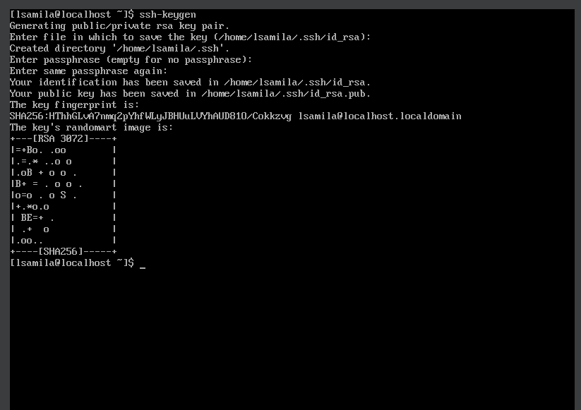

## compass-ansible-d01

# Neste desafio vou instalar o ANSIBLE e criar um YAML de ping para o IP do meu desktop

### Pré-requisitos:

- Python3
- OpenSSH
- VSCode

## Instale o OpenSSH, caso não o tenha:

- Instalação para Linux CentOS 8

```
sudo yum install openssh-server
```

- Inicie e habilite o serviço

```
sudo systemctl start sshd
sudo systemctl enable sshd
```

- Verifique as configurações do Firewall

```
sudo firewall-cmd --add-service=ssh --permanent
```

- Agora reinicie o firewall para aplicar as configurações

```
sudo firewall-cmd --reload
```

## Instalar o Ansible

Caso tenha alguma dúvida, siga está [documentação](https://docs.ansible.com/ansible/latest/installation_guide/intro_installation.html)

```
sudo yum install ansible
```

- Depois de instalar, verifique a versão para ter certeza que foi instalado corretamente:

```
ansible --version
```


### Configure o SSH

- Gere uma **SSH chave pública**, com o comando:

```
ssh-keygen
```



- Precisamos exportar essa chave para a outra máquina, mas primeiro você precisa saber o ip dessa máquina, para isso use o comando **_ip address_**

- Para exportar a chave use o comando:

```
ssh-copy-id nome-de-usuario@endereco-ip
```


- Teste a conexão manualmente:

```
ssh user@ip-address
```


- Você pode verificar se a chave foi colada, dessa forma:

```
ls -la  ##Para Listar todos os arquivos e pastas
ls .ssh/  ##Para verificar se foi criado um arquivo de chaves autorizadas
cat .shh/authorized_keys  ##Para visualizar o arquivo.
```


## No VSCODE

- Vamos precisar instalar uma extensão para uma melhor usabilidade

1. Instale uma extensão, chamada **Remote ssh**, é uma ferramenta da **Microsoft**


2. Depois faça a conexão via ssh para a sua VM


### Depois de fazer a conexão, crie uma pasta com nome de **ansible_teste**, e crie dois arquivos dentro dessa pasta, **hosts** e um outro arquivo com nome de **ping_playbook.yml**


- Dentro do arquivo **hosts**:

```
[desktop]
endereco-ip-sua-maquina ansible_user=seu-nome-de-usuario
```


- Dentro do arquivo **ping_playbook.yml**:

```
---
- name: ping all hosts
  gather_facts: false
  hosts: desktop
  tasks:
    - name: ping a host
      ping:
```


- Salve os arquivos e rode o playbook para o ping:

```
ansible-playbook -i hosts ping_playbook.yml
```

### Se tudo ocorrer bem, você receberá uma mensagem de sucess, como essa:


